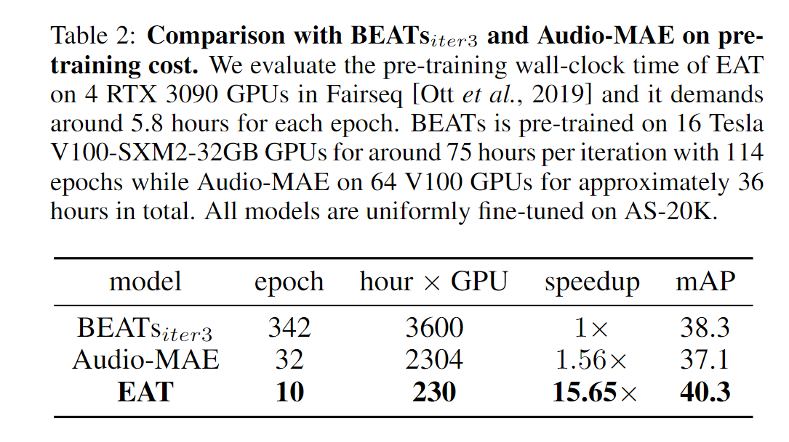

<!-- omit in toc -->
# EAT: Self-Supervised Pre-Training with Efficient Audio Transformer
[](https://github.com/cwx-worst-one/EAT)
[](https://github.com/cwx-worst-one/EAT)
[](https://github.com/cwx-worst-one/EAT)
[](https://github.com/cwx-worst-one/EAT)
[](https://github.com/cwx-worst-one/EAT)

**Guides**
- [Requirements and Installation](#requirements-and-installation)
- [Model Checkpoints](#model-checkpoints)
- [Feature Extraction](#feature-extraction)
- [Data Preparation](#data-preparation)
- [Pre-Training](#pre-training)
- [Fine-Tuning](#fine-tuning)
- [Inference](#inference)


<!-- omit in toc -->
## News :new:
- We release the codes for EAT pre-training and fine-tuning. 

<!-- omit in toc -->
## Introduction 
EAT is an audio SSL model with high effectiveness and efficiency during self-supervised pre-training. You can find details in the paper [EAT: Self-Supervised Pre-Training with Efficient Audio Transformer](https://arxiv.org/abs/2401.03497). 

## Requirements and Installation
To run the EAT code, you have two options for setting up your environment: manual setup or using our Docker image.

<!-- omit in toc -->
#### Manual Environment Setup
The minimum environment requirements are `Python >= 3.8` and `PyTorch >= 1.13`. 
```shell 
git clone https://github.com/pytorch/fairseq
cd fairseq
pip install --editable ./
git clone https://github.com/cwx-worst-one/EAT
```

<!-- omit in toc -->
#### Using Docker Image
We also provide a Docker image for an easier and more consistent setup. The Docker image will be released soon, containing all necessary dependencies pre-installed.

## Model Checkpoints
You could download the EAT checkpoints by Google Drive. 
- AS-2M [Pre-trained](https://drive.google.com/file/d/1PFUcDbvtZfxFcyaRv3RHsjy_QhvC1QBp/view?usp=sharing)
- AS-2M Pre-trained+[Fine-tuned](https://drive.google.com/file/d/1FNZ4LotG-VLRwrQJacsQyKQZnEah4i4w/view?usp=sharing) (AS-2M)
- AS-2M Pre-trained+[Fine-tuned](https://drive.google.com/file/d/1TyRG2xczQ6rvnkvEn0p2A-KbgSPKxcEI/view?usp=drive_link) (AS-20K)

## Feature Extraction
We provide the script for extracting audio features from the last layer of EAT encoder. The features are stored in `.npy` format and the sample rate of the extracted features is ~50Hz. EAT could provide frame-level features and utterance-level features (denoted by the CLS token).  
To extract latent representations from audio clips, you could use our pre-trained [checkpoint](https://drive.google.com/file/d/1PFUcDbvtZfxFcyaRv3RHsjy_QhvC1QBp/view?usp=sharing) or your owns, then please run the script `feature_extract.sh` by:
```bash
bash EAT/scripts/feature_extract.sh 
``` 

## Data Preparation
The main dataset in our experiment is [AudioSet](https://research.google.com/audioset/). Regrettably, we are unable to release the data due to copyright restrictions. Data manifest is available at [here](https://drive.google.com/file/d/1LH2C0q3d4zndoR3-oGkVdYYqDCIdxIsm/view?usp=drive_link). We follow the file format in [wav2vec](https://github.com/facebookresearch/fairseq/tree/main/examples/wav2vec) and [data2vec](https://github.com/facebookresearch/fairseq/tree/main/examples/data2vec), where `.tsv` format file is for index while `.lbl` and `.csv` format files are specific for classification task.  You could modify the files for your own database. 

## Pre-Training 
Our codes are adapted from [Audio-MAE](https://github.com/facebookresearch/AudioMAE) and [data2vec](https://github.com/facebookresearch/fairseq/tree/main/examples/data2vec). We employ `pretraining_AS2M.yaml` as our default pre-training config. To pre-train the EAT model, you could run the script `pretraining_AS2M.sh` by:
```bash
bash EAT/scripts/pretraining_AS2M.sh 
``` 

## Fine-Tuning
We employ `finetuning.yaml` as our default fine-tuning config. To fine-tune the EAT model in different downstream tasks, you could run the script `finetuning_{task}.sh`, where `{task}` includes `AS20K`, `AS2M`, `ESC50` and `SPCv2`. For example, you can fine-tune EAT on `AS20K` by executing: 
```bash
bash EAT/scripts/finetuning_AS20K.sh
``` 

## Inference 
For inference on AudioSet audio clips with fine-tuned models, you could use our EAT checkpoints fine-tuning on [AS-2M](https://drive.google.com/file/d/1FNZ4LotG-VLRwrQJacsQyKQZnEah4i4w/view?usp=sharing) or [AS-20K](https://drive.google.com/file/d/1TyRG2xczQ6rvnkvEn0p2A-KbgSPKxcEI/view?usp=drive_link)
and run the script `inference.sh` by: 
```bash
bash EAT/scripts/inference.sh 
``` 
An example output is as follows:
```python
# top_k_prediction = 12
{'Percussion': 0.5227, 'Drum kit': 0.4365, 'Vibraphone': 0.4196, 'Drum': 0.3161, 
'Music': 0.3035, 'Snare drum': 0.2766, 'Glockenspiel': 0.2248, 'Marimba, xylophone': 0.223, 
'Cymbal': 0.213, 'Bass drum': 0.2069, 'Hi-hat': 0.1961, 'Mallet percussion': 0.1704}
```


<!-- omit in toc -->
## Performance
Pre-training on AS-2M, EAT gains state-of-the-art (SOTA) performance on several audio and speech classification datasets including AS-20K, AS-2M, ESC-50 and SPC-2.    


<!-- omit in toc -->
## Efficiency
EAT achieves a total pre-training time reduction of ~15x compared to BEATs and ~10x relative to Audio-MAE. It costs only 10 epochs during EAT's pre-training on AS-2M.    
  


<!-- omit in toc -->
## Experiment Logs
We report the experiment logs using [wandb](https://wandb.ai). The logs will be released to view. 


<!-- omit in toc -->
## TODO 
- [x] release the pre-trained codes
- [x] release the fine-tuned codes
- [ ] release the experiment logs
- [ ] release the docker image


<!-- omit in toc -->
## Citation
If you find our EAT codes and models useful, please cite the following paper:
```
@article{chen2024eat,
  title={EAT: Self-Supervised Pre-Training with Efficient Audio Transformer},
  author={Chen, Wenxi and Liang, Yuzhe and Ma, Ziyang and Zheng, Zhisheng and Chen, Xie},
  journal={arXiv preprint arXiv:2401.03497},
  year={2024}
}
```

<!-- omit in toc -->
## Reference and Acknowledgement
Our codebase is based on the awesome [Audio-MAE](https://github.com/facebookresearch/AudioMAE) and [data2vec](https://github.com/facebookresearch/fairseq/tree/main/examples/data2vec) repo. 
